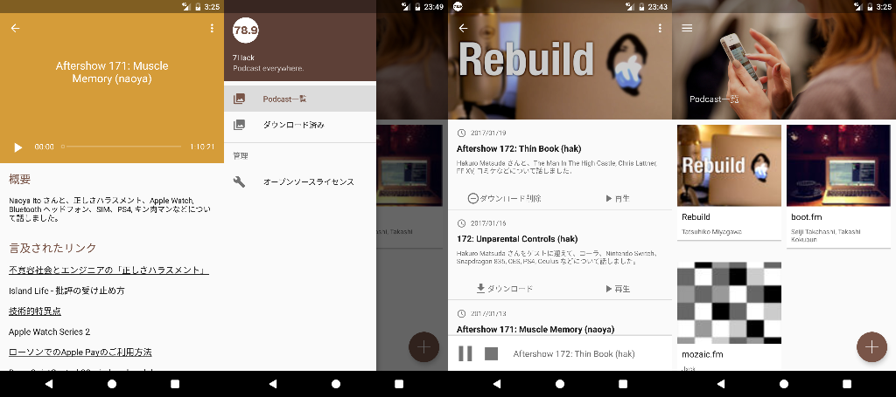
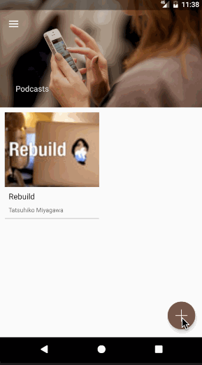

# 78.9 (7hack)

78.9 (7hack) is the podcast player for android.

## Screenshot



* Search podcasts
* Show episodes of podcast
* Show `Show notes` of episode
* Listen mp3 file by downloaded or streaming



## Development

This app uses [retrolambda](https://github.com/orfjackal/retrolambda), and so required Java8.

### Layers in app.

This app has adopted a simple mvc(not mvc2) architecture.

```
src/main/java/io/github/waka/sevenhack
|
|--activities (view controller)
|--data
| |--dao (access to sqlite)
| |--dxo (exchange model to entity)
| |--entities (sqlite table row)
| |--models (mapping from API)
| |--network (access to external api)
|--events (event bus)
|--internal
| |--constants
| |--di
|--logics (business logic)
|--media (mp3 player)
|--services (background service)
|--utils
|--views
  |--adapters (recycler view)
  |--components (custome view)
  |--dialogs (dialog builder)
  |--fragments (view with lifecycle)
  |--notifications (notification builder)
```

## Libraries

* Android Support Libraries
* [Dagger2](http://google.github.io/dagger/)
* [RxAndroid](https://github.com/ReactiveX/RxAndroid) 
* [Retrofit2](http://square.github.io/retrofit/)
* [OkHttp3](https://github.com/square/okhttp/tree/master/okhttp/src/main/java/okhttp3)
* [Picasso](http://square.github.io/picasso/)
* [SQLBrite](https://github.com/square/sqlbrite)
* [Parceler](https://github.com/johncarl81/parceler)
* [ThreeTenABP](https://github.com/JakeWharton/ThreeTenABP)
* [Stetho](http://facebook.github.io/stetho/)
* [LeakCanary](https://github.com/square/leakcanary)

## License

```
Copyright 2017 Yoshimasa Wakahara

Licensed under the Apache License, Version 2.0 (the "License");
you may not use this file except in compliance with the License.
You may obtain a copy of the License at

   http://www.apache.org/licenses/LICENSE-2.0

Unless required by applicable law or agreed to in writing, software
distributed under the License is distributed on an "AS IS" BASIS,
WITHOUT WARRANTIES OR CONDITIONS OF ANY KIND, either express or implied.
See the License for the specific language governing permissions and
limitations under the License.
```
